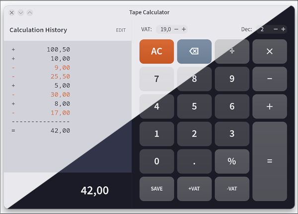

# Tape Calculator

A modern GTK4-based tape calculator with a professional adding machine interface, designed for accounting and financial calculations.

## Features

### Professional Tape Display
- **Columnar layout** with operation symbols and right-aligned amounts
- **Visual separators** (dashed lines) between calculation sections
- **Monospace font** for clear, aligned display
- **Auto-scrolling** to show latest entries
- **Permanent history** - all operations are recorded
- **Editable tape** - modify operations and recalculate results
- **Text selection and copying** - select and copy any portion of the tape
- **Save to file** - export tape to a text file

### Calculation Capabilities
- **Immediate execution model** - Results calculated as you type (like traditional adding machines)
- **Basic operations**: Addition (+), Subtraction (-), Multiplication (×), Division (/)
- **Percentage calculations** (%)
- **VAT calculations**:
  - Add VAT: `100,00 +19% | 19,00` → `119,00`
  - Subtract VAT: `119,00 -19% | 19,00` → `100,00`
  - Configurable rates: 16%, 19%, 20%, 21%
- **Configurable decimal places**: 0-6 decimal places
- **Locale-independent decimal parsing**: Works correctly with both period and comma input

### User Interface
- **Two-column layout**:
  - Left: Calculation history with running totals
  - Right: Calculator controls and keypad
- **Theme-aware**: Automatically adapts to your GTK theme (light/dark)
- **Compact design**: Efficient use of screen space
- **Clean, modern appearance**: Following GTK4 design principles
- **Settings persistence**: VAT rate and decimal places are automatically saved and restored

### Keyboard Support

Full keyboard operation for efficient data entry:

| Key | Function |
|-----|----------|
| `0-9` | Enter digits |
| `.` or `,` | Decimal point |
| `+` | Addition |
| `-` | Subtraction |
| `*` or `×` | Multiplication |
| `/` | Division |
| `%` | Percentage |
| `Enter` or `=` | Calculate result |
| `Backspace` | Undo last entry / Delete character |
| `Delete` or `Esc` | Clear all (AC) |

### Undo Functionality
- **Backspace button (⌫)**: Removes the last tape entry and recalculates
- Acts as an undo button for correcting mistakes
- When typing: deletes the last character
- After operations: removes the last tape line

## Building

### Dependencies
- GTK 4 (gtkmm-4.0)
- C++20 compiler (GCC 10+ or Clang 10+)
- Meson build system
- Ninja

### Ubuntu/Debian
```bash
sudo apt install build-essential meson ninja-build libgtkmm-4.0-dev
```

### Arch Linux
```bash
sudo pacman -S base-devel meson ninja gtkmm-4.0
```

### Fedora
```bash
sudo dnf install meson ninja-build gtkmm4.0-devel gcc-c++
```

### Build Instructions
```bash
# Clone or navigate to the project directory
cd tape-calc

# Configure the build
meson setup build --buildtype=release

# Compile
meson compile -C build

# Run
./build/tape-calc
```

### Development Setup

For Neovim users with LSP support:
```bash
ln -s build/compile_commands.json .
```

## Usage

### Basic Calculations
1. Enter a number using the keypad or keyboard
2. Press an operation button (+, -, ×, /)
3. Enter the next number
4. Press `=` or `Enter` to see the result

**Example**: `44 + 55 =`
```
+         44,00
+         55,00
---------------
=         99,00
```

### VAT Calculations

**Adding VAT**:
1. Enter the net amount (e.g., `100`)
2. Click `+VAT` button
3. Result shows gross amount with VAT breakdown in tape

**Example**: `100 +VAT(19%)`
```
+        100,00
+         19% | 19,00
---------------
+        119,00
```

**Removing VAT**:
1. Enter the gross amount (e.g., `119`)
2. Click `-VAT` button
3. Result shows net amount with VAT breakdown in tape

### Changing VAT Rate
Click the VAT rate button (e.g., `19%`) to cycle through:
- 19% (default)
- 20%
- 21%
- 16%

### Adjusting Decimal Places
Use the "Dec:" spinner control to change decimal precision (0-6 places).
All displayed values will update immediately.

### Settings Persistence
Your preferences are automatically saved and restored between sessions:
- **VAT rate**: Your selected VAT percentage (e.g., 19%, 20%) is remembered
- **Decimal places**: Your preferred precision setting (0-6) is preserved

Settings are stored in `~/.config/tape-calc/settings.conf` and updated automatically whenever you change them. No manual saving required!

### Editing the Tape
After completing a calculation, you can edit the tape to correct operations:

1. Click the **EDIT** button (appears after pressing `=`)
2. Modify any operation symbol or value directly in the tape
3. Click **DONE** to recalculate the result

**Example**: Change a calculation from addition to subtraction:
```
+         12,00
+         10,00    ← Edit this + to -
---------------
=         22,00
```

After editing to `-` and clicking DONE:
```
+         12,00
-         10,00
---------------
=          2,00
```

**Notes**:
- Only modify operation symbols (`+`, `-`, `*`, `/`) and values
- The calculation recalculates automatically when you click DONE
- Pressing AC while in edit mode exits edit mode and clears

### Copying and Saving the Tape
- **Copy**: Select any text in the tape and use Ctrl+C (or Cmd+C on Mac)
- **Save to file**: Click the save button (💾) to export the entire tape to a text file

## Technical Details

### Architecture
- **Engine**: Pure C++ calculation logic (`calculator_engine.cpp`)
  - Locale-independent decimal parsing
  - Immediate execution model
  - Tape history management
- **UI**: GTK4/gtkmm interface (`mainwindow.cpp`)
  - Responsive layout
  - Theme integration
  - Keyboard handling

### Locale Support
The calculator uses **locale-independent decimal parsing** to ensure consistent behavior:
- Input uses period (`.`) as decimal separator internally
- Display respects system locale (shows comma in German locale)
- Calculations are accurate regardless of locale settings

### Project Structure
```
tape-calc/
├── src/
│   ├── main.cpp              # Application entry point
│   ├── mainwindow.cpp/h      # GTK4 UI implementation
│   └── calculator_engine.cpp/h  # Calculation logic
├── assets/                   # Application icon
├── meson.build               # Build configuration
└── README.md                 # This file
```

## Design Philosophy

This calculator follows the **tape calculator** (adding machine) paradigm:
1. **Immediate execution**: Each operation is performed immediately, not deferred
2. **Permanent record**: All operations are recorded in the tape
3. **Visual feedback**: Clear display of what was entered and calculated
4. **Professional format**: Columnar layout similar to traditional accounting machines

## Features Roadmap

Potential future enhancements:
- [ ] Custom VAT rates
- [ ] Memory functions (M+, M-, MR, MC)
- [ ] Save/load calculation sessions
- [ ] Print tape directly to printer

## Contributing

Contributions are welcome! The codebase is organized with clear separation between calculation logic and UI.

## Acknowledgments

Based on [GTK4-Calculator](https://github.com/hans-chrstn/GTK4-Calculator) by hans-chrstn, enhanced with tape calculator functionality, VAT calculations, and professional accounting features.

Built with:

- [GTK 4](https://www.gtk.org/) - Modern UI toolkit
- [gtkmm](https://www.gtkmm.org/) - C++ bindings for GTK
- [Meson](https://mesonbuild.com/) - Build system

Application icon available in `/assets` directory.

## Disclaimer

This project was created with the assistance of an AI agent. I do not have great expertise in C++, so the code has not really been reviewed. Anyone using or extending this project should independently verify its correctness, safety, and suitability for their use case. 

## Screenshot

